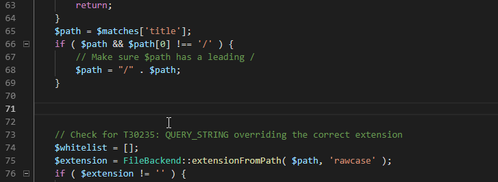

<h2 align="center">
Welcome! I'm <a href="https://franciscolaracasalilla.com/" target="_blank" rel="noreferrer">Fran Lara</a> 👋 and I'm a Back-end Developer! 👨🏻‍💻
</h2>

<h4>
So, yes... I like making the things work, not good looking ⚙
</h4>

In other words, I love being a boiler room officer, despite people only remind you when the ship does not move 😅

#### I've been coding since I was 7 ⏳ and, professionally, since 2006 💻

##### In my recent experience you could find:

 

##### Along the previous ones:

 

##### Also crossed in my life:

 

##### And, of course, if you want to know more or more detailed about me:

 

💬 Do not hesitate to reach me if you want to ask me any question or just have a professional contact!
